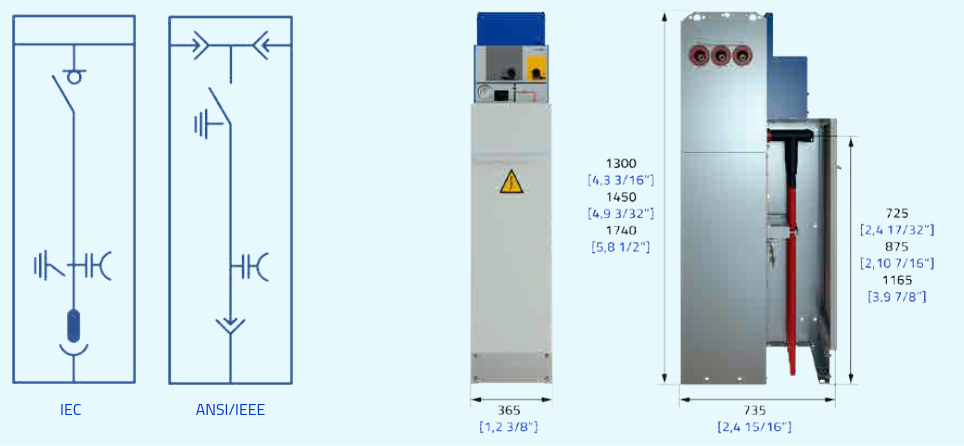
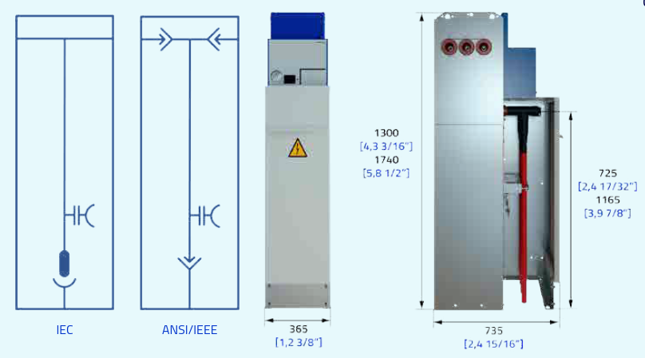
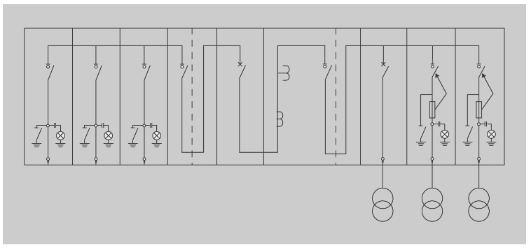

1.- Configuració dels centres de transformació (CT): Estructura del sistema elèctric.
==============================================================================

Índex
-----

+ Estructura del sistema elèctric.
+ Situació i funció dels centres de transformació en el sistema elèctric.
+ Classificació dels CT. 
+ Parts fonamentals d'un CT.
+ Transformador de distribució.
+ Aparellatge.
+ Esquemes unifilars.
+ Cel·les. Tipus i senyalització.
+ Quadre de distribució de baixa tensió.
+ Instal·lació de terra.


0.- Introducció
---------------

Atesa la gran importància de l’energia elèctrica en la nostra civilització, l’estudi de les instal·lacions de distribució s’inicia amb el recorregut bàsic per aquesta energia, des de la producció fins a arribar al consum.

En els primers dies de la distribució elèctrica, els generadors de corrent continu estaven connectats a les càrregues al mateix voltatge.

La generació, la transmissió i la càrrega havia de ser de la mateixa tensió, perquè no hi havia manera prou eficient de canviar els nivells de tensió de corrent continu.

Les tensions utilitzades eren de 100 V, que era la tensió de les càrregues principals (làmpades incandescents). Aquesta baixa tensió també requeria menys aïllament per a una distribució segura als edificis.

D’altra banda, per mantenir les pèrdues elèctriques dels cables a un nivell econòmicament raonable, el sistema de corrent continu necessitava cables gruixuts i la producció local d’electricitat.

Les primeres plantes de generació de corrent continu havien d’estar com a màxim a 2,4 km del client més allunyat, per evitar que els conductors fossin excessivament grans i cars. En l’actualitat la distribució de corrent es fa amb corrent altern i tensions molt més elevades, pels canvis en consum elèctric i la seva optimització. 


1.- Estructura del sistema elèctric
-----------------------------------

El sistema de subministrament elèctric sempre comprèn el conjunt de mitjans i elements útils per a la generació, el transport i la distribució de l’energia elèctrica. Aquest conjunt està dotat de mecanismes de control, seguretat i protecció.

Aquest sistema elèctric està regulat per un sistema de control centralitzat que garanteix una explotació racional dels recursos de generació i una qualitat de servei d’acord amb la demanda dels usuaris, compensant les possibles incidències i fallades produïdes.

Amb aquest objectiu, tant la xarxa de transport com les subestacions que hi estan associades poden ser propietat, totalment o en part i, en tot cas, estar operades i gestionades per un ens independent de les companyies propietàries de les centrals i de les distribuïdores o comercialitzadores d’electricitat.

Així mateix, el sistema necessita una organització econòmica centralitzada per planificar la producció i la remuneració als diferents agents del mercat si, com passa actualment en molts casos, existeixen múltiples empreses que participen en les activitats de generació, distribució i comercialització.

El sistema elèctric està format per tres subsistemes:

- **Producció**, en el qual s’inclouen les centrals generadores d’energia, ja siguin hidroelèctriques, nuclears, eòliques, etc.
- **Transport**, en el qual s’inclouen línies de transport MAT (molt alta tensió), les centrals elevadores i reductores, i les estacions de distribució.
- **Distribució**, que està constituït per xarxes primàries de distribució, estacions transformadores de distribució i xarxes secundàries de distribució.


Les tensions de generació de l’energia elèctrica a les centrals oscil·la entre 6 kV i 18 kV, a freqüència nominal de 50Hz, tensions que no són suficients per transportar-la a grans distàncies, on solen estar els centres de consum. Per això abans de sortir de les centrals es transforma la tensió.

Aquestes tensions són elevades a la sortida de les centrals, amb valors superiors (132 kV, 220 kV i 380 kV…) perquè les pèrdues per l’efecte joule siguin les més petites possible durant el transport de l’energia elèctrica des d’allà fins als centres de consum.

La xarxa de transport en AT es operada a tot el sistema nacional per REE sigles de «Red Eléctrica de España» (ver [¹][1]), La xarxa de transport es aquella tal que U ≥ 220kV, **Excepte a les illes** a on U ≥ 66kV [²][2].

Les xarxes de distribució poden ser de tipus primària (formada per línies aèries o subestacions de 45 a 66 kV o 132kV i subestacions de transformació) o secundària (formada per línies aèries o subterrànies de 15 a 20kV, centres de transformació d’MT a BT i línies aèries o subterrànies de BT). També anomenades xarxes de distribució d'AT i MT respectivament [³][3])

Les línies elèctriques incloses en el Reglament sobre condicions tècniques i garanties de seguretat en línies elèctriques d’alta tensió es classifiquen, d’acord amb la tensió nominal, en les categories següents:

- Categoria especial, en la qual s’inclouen les de tensió nominal igual o superior a 220 kV i les de tensió inferior que formin part de la xarxa de transport d’acord amb el que estableix l’article 5 del Reial decret 1955/2000, d’1 de desembre.
- Primera categoria, que inclou les de tensió nominal inferior a 220 kV i superior a 66 kV.
- Segona categoria, en la qual s’encabeixen aquelles que tenen una tensió nominal igual o inferior a 66 kV i superior a 30 kV.
- Tercera categoria, en la qual s’encabeixen aquelles que tenen una tensió nominal igual o inferior a 30 kV i superior a 1 kV. 

Si en la línia hi ha circuits o elements en què s’utilitzen diferents tensions, el conjunt de la línia s’ha de considerar d’acord amb el valor de la tensió nominal més gran. 


2.- Situació i funció dels centres de transformació en el sistema elèctric
-------------------------------------------------------------------------- 

La tensió (20 kV, 66 kV…) de les xarxes de distribució que alimenten els centres de consum necessita ser reduïda a la tensió d’utilització en baixa tensió, que és de 400/230 V, la qual cosa es fa en els centres de transformació, mitjançant un transformador (transformador de distribució).

S’anomena centre de transformació (CT) la instal·lació proveïda d’un o diversos transformadors reductors d’alta tensió (AT) a baixa tensió (BT) amb l’aparellatge i l’obra complementària necessària.


3.- Classificació dels CT.
--------------------------

Els centres de transformació es poden classificar segons els diferents criteris que es descriuen tot seguit:

1. Per la seva ubicació: d’acord amb la seva ubicació, les Normes tecnològiques de l’edificació (NTE) classifiquen els CT en els tipus següents:
    - Interiors: quan el recinte del CT està situat dins d’un edifici o nau, per exemple en la planta baixa, soterrani, etc.
    - Exteriors: quan el recinte que conté el CT està fora d’un edifici, és a dir, no en forma part. En aquest cas, poden ser:
        + De superfície: per exemple, una caseta d’obra civil o prefabricada, dedicada exclusivament al CT, edificada sobre la superfície del terreny.
        + Subterrani: per exemple, un recinte excavat sota d’un carrer (habitualment la vorera).
        + Semisoterrani: situació intermèdia, una part queda sota de la cota zero del terreny i una altra part queda per damunt d’aquesta cota zero.

2. Per la connexió de servei: és a dir, d’acord amb la connexió d’alimentació de l’MT, poden ser alimentats 
    - per línia aèria o 
    - per cable subterrani.

3. Per l’emplaçament: segons on sigui l’emplaçament dels aparells que els constitueixen, els centres de transformació es poden classificar també de la manera següent:
    - Interiors: quan els aparells (transformadors i equips d’MT i BT) estan dins d’un recinte tancat.
    - Intempèrie: quan els aparells queden a la intempèrie, per exemple sobre pals o bé en envolupants prefabricades, és a dir, transformadors i cabines construïdes per servir a la intempèrie.

4. Per la seva alimentació: de manera que, depenent de la seva alimentació a la xarxa de distribució, els centres de transformació poden ser:
    - de punta: CT situat al final del ramal d’una xarxa;
    - de transformació de pas: CT en un punt del ramal d’una xarxa.

5. Per la seva propietat: els centres de transformació (CT) poden ser:
    - d’empresa;
    - d’abonat.


### 3.1.- Centres de transformació d'empresa i d'abonat

Atenent a la propietat, els centres de transformació poden ser d’empresa i d’abonat. Quan es tracta d’alimentar diversos abonats en BT, l’empresa distribuïdora instal·la un centre de transformació de potència adequada al consum previst del conjunt d’abonats. Per tant, el centre de transformació és propietat de l’empresa subministradora d’electricitat, la qual n’efectua l’explotació i el manteniment, i es responsabilitza del seu funcionament. Així doncs, aquest tipus de CT forma part de la xarxa de distribució també anomenada d’empresa.

Com sigui que el preu de l’energia en MT és més baix que en BT, a partir de certes potències (kVA) i/o de certs consums (kWh) és més favorable contractar el subministrament en MT, tenint en compte el cost del centre de transformació i el seu manteniment (ambdós a càrrec de l’abonat). Aquesta opció de centre de transformació propi presenta altres avantatges addicionals: 

- la independència respecte d’altres abonats de BT;
- el fet de poder triar el règim de neutre de BT més convenient, aspecte important per a certes indústries, per exemple les de procés continu, en les quals la continuïtat de servei pot ser prioritària;
- el fet de poder construir el centre de transformació, ja previst per a futures ampliacions.

Els centres de transformació d’empresa són, en general, de concepció més simple que els centres de transformació d’abonat, els quals són, en molts casos, de potència més elevada i amb un esquema elèctric més complex, entre altres motius pel fet de tenir l’equip de comptatge en el mateix centre de transformació i en el costat d’MT.


### 3.2.- Centres de transformació d'abonat o client amb dues alimentacions

A arrel d'aquest punt existeix molta bibliografía al respecte. Els llibres de text [⁴][4] tendeixen a copiar mecànicament les NTE aprovades al 1977 [⁵][5], en quan a les diferents tipologies de repartiment de les xarxes. No obstant, a aquest punt es suficient parlar de que els centres de transformació en amb una sola línia responen a esquemes radials o d'antena. En canvi els que tenen 2 alimentacions responen a esquemes de bucle obert.


4.- Parts fonamentals d'un CT
-----------------------------

### 4.1.- Envolupant

Allò que delimita l'espai destinat al CT. Totes les parts de l'envolupant, s'ajustaran constructivament al CTE i a les ordenances municipals corresponents. Especialment al que a estructura, aïllament acústic i antiincendis es refereix. L'envolupant tindrà una EI240 i la estructura una R240. Inclou:

#### 4.1.1.- Parets

La part metàl·lica (barres estructurals a dins de les parets) de les parets estarà unit a la terra de protecció.

#### 4.1.2.- Solera
 
- La solera ha d'anar com a mínim 20 cm per sobre del nivell de carrer, de formigó armat de, almenys, 10 cm de gruix, descansant sobre una capa de sorra piconada. 
- Es preveuran, en els llocs apropiats per al pas de cables, uns orificis destinats a aquest efecte, inclinats cap avall i amb una profunditat mínima de 0,4 m.
- Es rematarà amb una capa de morter de composició adequada per a evitar la formació de pols i augmentar la resistència a l'abrasió. Aquesta capa de rematada s'executarà amb un lleuger pendent, cap a l'exterior del CT.
- En la zona de maniobra suportarà una càrrega distribuïda mínima de 400 kg/m².
- En la zona del transformador i en els seus accessos suportarà una càrrega rodant de 4000Kg recolzada sobre quatre rodes equidistants.


#### 4.1.3.- Portes
 
- Les portes d'accés al CT se situaran preferentment en una mateixa façana. 
- S'obriran cap a l'exterior 180°, hauran de poder abatre's sobre el parament reduint al mínim els seus sortints i disposaran d'un sistema de retenció que asseguri la seva obertura mentre existeixi a l'interior personal de servei.
- El grau de protecció de les portes serà com a mínim IP 23 i *IK 10 i seran incombustibles.
- Totes les portes, aniran instal·lades de manera que no estiguin en contacte amb el sistema de connexió a terra general del CT ni amb cap element metàl·lic connectat a aquest sistema, i separades almenys 10 cm de les armadures dels murs.

#### 4.1.4.- Ventilacions 

- Per al tancament dels buits de ventilació es disposaran reixes metàl·liques que impedeixin l'entrada d'aigua i petits animals.
- Les dimensions de les reixes seran tals que verifiquin la secció mínima necessària per a la correcta evacuació de la calor generada a l'interior del CT, d'acord amb l'indicat en el document Càlculs Justificatius.
- Igual que les portes, les reixes de ventilació s'instal·laran de manera que no estiguin en contacte amb el sistema de connexió a terra general del CT ni amb cap element metàl·lic connectat a aquest sistema, separades almenys 10 cm de les armadures dels murs o la solera i de manera que la part inferior de les reixes estigui situada com a mínim a 0,25 m de la rasant exterior del CT.
- Les reixes de ventilació podran col·locar-se també inserides a les portes d'accés.

### 4.2.- Cel·les de MT

Per equipar els centres de transformació, en el mercat hi ha conjunts d’aparellatge de maniobra MT, inclosos els transformadors de mesura, ja muntats i connexionats entre si, dins de recintes metàl·lics, fins als borns de connexió a l’exterior.

Es denominen habitualment “cabines prefabricades”, o simplement “cabines” o “cel·les” metàl·liques, les quals reben el nom de conjunts d’aparellatge MT sota envolupant metàl·lica en les normes UNE.

Per tant, en el cas dels CT, més que aparells de maniobra solts (individuals), el que s’utilitza habitualment són aquests conjunts d’aparellatge sota envolupant metàl·lica, que se subministren ja muntats, connexionats i provats de fàbrica.

En l’actualitat, la confecció de conjunts d’aparellatge MT sota envolupant metàl·lica es realitza de manera modular a base d’unitats individuals (cabines o cel·les) acoblades mecànicament entre si, i connectades també elèctricament, de manera que el conjunt constitueixi l’esquema elèctric
projectat.

Hi ha diversos tipus de cabines o cel·les quant a l’esquema elèctric individual, les quals corresponen a les diferents funcions o parts de l’esquema elèctric general del conjunt. Aquests diferents mòduls individuals són mecànicament acoblables entre si, i connectables elèctricament també entre si.

Així, per exemple, hi ha cabines individuals per a funcions com l’entrada
d’alimentació de sortida, l’acoblament de barres, el comptatge, etc., o bé pel que fa al tipus d’aparells de maniobra, com ara cel·les amb interruptor automàtic, cel·les amb interruptor-seccionador, cel·les amb interruptor-seccionador amb fusibles, etc.

És més, s’han desenvolupat també conjunts modulars amb envolupant única, els quals agrupen diverses funcions individuals i formen conjunts d’esquemes estandarditzats. Per exemple, dues línies d’alimentació i una de sortida a transformador, és a dir, tres funcions, o bé dues línies d’alimentació i dues sortides a transformadors, és a dir, quatre funcions, etc.

La connexió de les diferents cel·les es realitza amb uns adaptadors que
permeten la connexió elèctrica i mecànica. Aquests adaptadors se situen
en els laterals de les cel·les.


#### 4.2.5.- Interruptors-seccionadors amb fusible

Són interruptors-seccionadors que duen fusibles per tant, son a més, portafusibles.


### 4.3.- Quadre de BT

El CT anirà dotat d'un o dos quadres modulars de distribució de baixa tensió, la funció de la qual és la de rebre el circuit principal de BT procedent del transformador i distribuir-lo en un nombre determinat de circuits individuals.

Els quadres de BT solen tenir 4/8 sortides i segueixen la norma informativa FNL002. Es podran instal·lar igualment quadres de BT amb interruptors automàtics tetrapolars d'intensitat i poder de tall adequats en lloc de fusibles, per a la protecció de cada sortida de BT.
Les bases portafusibles a utilitzar seran del tipus BTVC, prenent com a referència la norma informativa NNL012 Bases Tripolars Verticals Tancades per a Fusibles de Baixa Tensió del Tipus Fulla amb Dispositiu Extintor d'Arc.

Te dues sortides per a serveis auxiliars: Circuit de protecció tèrmica, i quadre de serveix auxiliars


### 4.4.- Cablejat de MT

Igual que per a les línies d'alimentació, s'utilitzaran cables unipolars aïllats amb aïllament de polietilè reticulat prenent com a referència la norma informativa DND001 Cables aïllats per a xarxes aèries i subterrànies de Mitjana Tensió fins a 30 kV.

S'empraran cables d'alumini de 95 mm² de secció per al cas de tensió més elevada del material 24 kV i de 150 mm² per a tensions de fins a 36 kV.
Per al transformador els terminals podran ser convencionals o endollables en funció de les característiques del transformador instal·lat, prenent com a referència la norma informativa GST001 MV/LV Transformers. Per a les cel·les de MT, seran sempre de tipus endollable.

Per exemple:
 • Els cables MT seran 12/20 kV del tipus RH5Z1, unipolars, amb conductors de secció i material 1x95 Al.
 • La terminació al transformador EUROMOLD de 24 kV del tipus endollable colzada i model K158LR.
 • En l'altre extrem, en la cel·la, és EUROMOLD de 24 kV del tipus endollable recta i model K152SR.


### 4.5.- Cablejat de BT

La unió entre les bornes BT del transformador i el quadre de BT s'efectuarà per mitjà de cables aïllats unipolars d'alumini del tipus XZ1, amb aïllament de polietilè reticulat (XLPE) de 0,6/1kV i coberta de poliolefina que prendran com a referència la norma informativa CNL001 Cables Unipolars per a Xarxes Subterrànies de Distribució BT de tensió assignada 0,6/1 kV.

La connexió del quadre de BT amb el transformador es farà mitjançant un pont únic, excepte per als transformadors bitensión, en què s'instal·larà un pont independent per a cada tensió.

La composició dels ponts de BT en funció de la potència i la tensió del secundari del transformador es determinen en el capítol corresponent del document “Càlculs Justificatius”.

En general, els ponts de BT dels CT prefabricats s'instal·laran a l'aire. En cas d'instal·lar-se sobre safates, preferiblement seran de PVC i si es disposen sobre safates metàl·liques aquestes hauran de connectar-se a la xarxa de terra de protecció.

### 4.6.- Elements auxiliars

#### 4.6.1.- Quadre serveis

El quadre de serveis s'utilitza per a alimentar aquells aparells que necessiten energia en Baixa tensió, com les unitats de telecomandament, la il·luminació, certes proteccions, etc.

Per a l'enllumenat interior del CT s'instal·laran els punts de llum necessaris per a aconseguir, almenys, un nivell mitjà d'il·luminació de 150 lux. En qualsevol cas, es col·locaran com a mínim dos punts de llum, disposats de tal forma que es mantingui la màxima uniformitat possible en la il·luminació i que la seva substitució pugui realitzar-se sense perill de contacte amb altres elements en tensió.

Per a execució del circuit d'enllumenat i serveis auxiliars s'utilitzaran conductors del tipus HO5V-K de coure de 2,5 mm² de secció, classe 5 i aïllament termoplàstic, allotjats a l'interior de tubs aïllants i la seva connexió es realitzarà d'acord amb l'indicat en el pla Esquema connexió serveis auxiliars.

Els interruptors de l'enllumenat estaran situats en la proximitat de les portes d'accés amb un pilot que indiqui la seva presència.

#### 4.6.2.- Separadors

A l'efecte de seguretat, quan l'edifici del CT no estigui proveït d'envà separador de sales, caldrà instal·lar una pantalla que impedeixi el contacte accidental amb les parts en tensió, per a complir l'indicat en la ITC-RAT 14.
En el cas que les pantalles siguin metàl·liques es connectaran a terra.
Entre les parts en tensió i les pantalles de protecció haurà d'existir una distància mínima que compleixi l'indicat en la ITC-RAT 14.
Les pantalles de protecció seran de xapa galvanitzada i disposaran d'un espiell transparent de dimensions mínimes 400x200 mm situada a 1,5 m. del sòl.

#### 4.6.3.- Llosa antivibratòria

El transformador de potència se situarà sobre una llosa flotant per a minimitzar les possibles vibracions de baixa freqüència emeses pel transformador.

La llosa flotant serà d'obra civil construïda directament sobre la solera del CT o prefabricada prenent com a referència l'especificació informativa 710022.
El detall de la llosa s'especifica en el pla corresponent.


#### 4.6.3.- Depòsit de recollida d'oli

Amb la finalitat contenir i evitar l'abocament de l'oli dielèctric del transformador davant un eventual vessament, quan aquest contingui més de 50 litres de dielèctric líquid en el seu interior, es disposarà d'una cubeta proveïda de tallafocs, segons s'indica en l'apartat 5.1 de la ITC-RAT 14, que retingui o canalitzi l'oli a un dipòsit amb revestiment estanc que suporti temperatures superiors a 400 °C.

El tallafocs s'aconseguirà a base d'una reixeta metàl·lica que tancarà superiorment la cubeta i sobre la qual es disposarà un llit de còdols.
El dipòsit de recollida d'oli tindrà una capacitat mínima de 650 litres i, en general, se situarà sota el transformador col·locat sobre la llosa flotant anti-vibratòria.

En aquells casos en els quals no es pugui situar el dipòsit sobre la llosa flotant, com a alternativa, podrà col·locar-se també en la zona de servitud de les cel·les o en un lloc extern al CT que no ofereixi cap risc addicional.

Estarà comunicat amb la cubeta mitjançant un tub d'acer de 100 mm de diàmetre.


5.- Transformador de distribució
--------------------------------

Constitueixen el darrer punt de transformació a la xarxa de distribució elèctrica. S'utilitzen per reduir la tensió elèctrica a nivells inferiors a 1000V. Normalment 230/400V o 127/220V a Espanya.

En general a Espanya les potències dels transformadors de distribució són de 1000kVA com a màxim. Tot i això, aquesta potència està reservada a casos molt especials, essent el valor màxim habitual de 400kVA, amb la possibilitat d'ampliar-los a 630kVA en el futur. No obstant, en general els CTs es dimensionen per 1000kVA.

Un transformador és una màquina elèctrica estàtica d’inducció electromagnètica que permet convertir els valors de tensió i d’intensitat de corrent subministrat per una font de corrent altern en un sistema de corrent altern o més d’un amb valors de tensió i d’intensitat de corrent diferents, però de la mateixa freqüència.

Un transformador acostuma a estar format bàsicament de tres parts:
- Un nucli de material ferromagnètic que forma un circuit magnètic tancat.
- Un enrotllament o debanament primari al qual s’aplica un corrent elèctric.
- Un enrotllament o debanament secundari que proporciona un corrent
elèctric de sortida. 

En alguns casos n’hi pot haver més d’un de secundari.
En l’actualitat, els tipus constructius dels transformadors de distribució per a un CT són pràcticament els següents:
- transformadors de bany d’oli mineral;
- transformadors d’aïllament sòlid a base de resines, denominats «transforma-
dors secs»;
- transformadors de bany de silicona líquida en lloc d’oli mineral, que
conforma un tercer tipus, molt menys freqüent.

Per a la distribució s’utilitzen generalment transformadors trifàsics (o
grups de tres monofàsics) i, excepcionalment, transformadors monofàsics
si la potència és inferior a 5 kVA

Depenent del tipus de connexió, les tensions simples del primari i del secundari poden no estar en fase, cosa que sempre passa en els transformadors monofàsics.

Per indicar el desfasament que hi ha entre les tensions simples, s’acostuma a
utilitzar l’anomenat índex horari (és a dir, l’angle format per l’agulla gran i la petita d’un rellotge quan marca una hora exacta), expressat en múltiples de 30° (l’angle entre dues hores consecutives, 360°/12 = 30°).


6.- Aparellatge
---------------

### 6.1.- Seccionadors

#### 6.1.1.- Seccionador simple

Un seccionador o desconectador és un component electromecànic que permet separar de manera mecànica un circuit elèctric de la seva alimentació, garantint visiblement una distància satisfactòria d'aïllament elèctric. L'objectiu pot ser, per exemple, assegurar la seguretat de les persones que treballin sobre la part aïllada del circuit elèctric o bé eliminar una part avariada per a poder continuar el funcionament amb la resta del circuit.

Almenys que s'especifiqui, un seccionador, a diferència d'un disjuntor o d'un interruptor, no té mecanisme de supressió de l'arc elèctric i per tant manca de poder de tall. És imperatiu detenir el funcionament del circuit amb anterioritat per a evitar una obertura en càrrega. En cas contrari, es poden produir danys severs en el seccionador deguts a l'arc elèctric [⁶][6]

#### 6.1.2.- Seccionadors de posada a terra

Per a treballs i reparacions en algunes parts dels circuits elèctrics, sol ser un requisit de seguretat que aquesta part estigui connectada a terra durant els treballs. En aquest cas, s'han de tancar els corresponents seccionadors de connexió a terra.


### 6.2.- Interruptors

Els interruptors, a diferència dels seccionadors, si són capaços d'extingir l'arc elèctric. D'interruptors n'hi ha de diversos tipus.

[seccionadors obrint i tancant amb càrrega](https://www.youtube.com/watch?v=9GeXkussHfw)


#### 6.2.1.- Interruptors de ruptura per aire (ABCB)

S'anomenen de ruptura per aire ja que utilitzen aquest mitjà (aire comprimit) com a dielèctric de supressió d'arc elèctric produït durant l'apertura i tancament de l'interruptor.

S'utilitzen en general per a les insta·lacions a la intempèrie, i el seu rang de funcionament es de fins als 33kV i 10kA.

Entre els seus avantatges es poden anomenar que:
- són més econòmics
- requereixen menys manteniment
- són robustos
- no presenten risc d'incendi
- són d'actuació ràpida

Tot i que també presenten les següents diferències:
- són més pesats i voluminosos
- l'extinció de l'arc pot esser difícil en alguns casos (carregues importants) al utilitzar l'aire com a dielèctric.

[video explicatiu del funcionament (anglès)](https://www.youtube.com/watch?v=TX3RKwFcqUc)


#### 6.2.2.- Interruptors de buit (VCB)

El funcionament de l'interruptor de buit es basa en que quan els contactes de l'interruptor s'obren dins d'un buit, es pot crear un arc entre els contactes a causa de la ionització de vapor metàl·lic en els contactes. Tanmateix, l'arc tendeix a apagarse ràpidament ja que produeixen electrons, ions i vapors metàl·lics a tot arreu. Així, l'arc es condensa ràpidament a l'exterior dels contactes de l'interruptor, permetent que la rigidesa dielèctrica es recuperi ràpidament.

[interruptors de buit](https://www.youtube.com/watch?v=vvhG38dqXsQ)
[vídeo cel·la de Siemens (minut 4:35) (anglès)](https://youtu.be/FXq3SzmjwQA?feature=shared&t=265)


#### 6.2.3.- De ruptura per bufat magnètic
	
És una tècnica per a trencar l'arc que es produeix en obrir un interruptor. Consisteix a produir, per l'acció d'un camp magnètic excitat pel propi corrent a tallar, un ràpid allargament de l'arc, sent conduït a l'interior d'una cambra d'extinció de material aïllant refractari i de gran capacitat d'absorció calorífica. En sèrie amb els contactes de l'interruptor es munta una bobina de bufat. El corrent que circula per ella produeix un flux magnètic. Quan es forma l'arc, aquest produeix un camp al seu voltant, que es repel·leix amb el de la bobina. L'arc sofreix una embranzida cap amunt, fent-se més llarg fins que es talla. Els equips que empren aquesta tècnica són molt robustos, admeten un elevat nombre de maniobres i la seva seguretat és gran en tenir l'arc confinat. No obstant això, la seva grandària és molt gran per a alta tensió, i el bufat és nul en el pas per zero, la qual cosa impedeix el seu ús en corrent continu.

[ref mec](http://ares.cnice.mec.es/gtm/web/index_es_resultado_final.php?num=240013%7C&Buscar=Soplado%20magn%C3%A9tico%7C&volver=Soplado%20magn%C3%A9tico&cual=0&gtm=733ea069987e91dbc4d2eff6cc729bbd)


#### 6.2.4.- Submergit en oli

Els interruptors de circuit d'oli utilitzen, com el seu nom indica, l'oli com a mitjà per apagar un arc. Els contactes estan totalment immersos en l'oli, que proporciona propietats aïllants i dielèctriques.

Quan s'utilitza, hi ha una quantitat important de calor que s'acumula a mesura que l'arc crea vapors d'oli que es descomponen en gas hidrogen. Això crea una gran bombolla d'hidrogen al voltant de l'arc movent l'oli. Aquesta bombolla comença a encongir-se, la qual cosa mou l'oli cap a l'arc, on el gas d'hidrogen el refreda.

#### 6.2.5.- D'hexafluorur de sofre

[interruptors SF6](https://www.youtube.com/watch?v=k6spLhEge6I)

[interruptor SF6 obert, sense electricitat. Interesa veure la velocitat](https://www.youtube.com/watch?v=LPds0uRZnto)

[Interruptor SF6, especejament, potser un poc massa poc clar](https://www.youtube.com/watch?v=mwzPCfJbCIg)

#### 6.2.6.- Interruptors automàtics

Els interruptors sí son capaços d'extingir l'arc elèctric produït per un tall en càrrega, es a dir, tenen un poder de tal. En el cas del automàtics, a més la interrupció es donarà per si mateixa si es compleixen certes condicions, com una sobrecàrrega o curt-circuit


#### 6.2.7.- Interruptors seccionadors

Combinen ambdós dispositius


### 6.3.- Parallamps o sobretensions
Parallamps de resistència variable, que eviten sobretensions sense deixar de donar servei, i deriven a terra la sobreintensitat originada per la sobretensió. Tenen sistema de desconnexió de terra per tal d’evitar curtcircuits fase-terra.

[protector de sobretensions de vàlvules](https://circuitglobe.com/valve-type-lightning-arrester.html)


### 6.4.- Instal·lació de posada a terra
Segons indiquen les instruccions MIE-RAT 13, del Reglament sobre condicions tècniques i garanties de seguretat en centrals elèctriques, subestacions i centres de transformació (aprovat pel Reial decret 3275/1982, de 12 de novembre), la posada a terra en instal·lacions elèctriques d’alta tensió (en les quals s’inclouen els centres de transformació) consta del següent:

- línies de terra;
- elèctrodes.

#### 6.4.1.- Línies de terra

Les línies de terra estan constituïdes pels conductors que uneixen els elèctrodes amb els elements que han de quedar posats a terra. Els conductors emprats tenen una resistència mecànica adequada i una elevada resistència a la corrosió.

Els conductors de les línies de terra s’han d’instal·lar intentant que el seu recorregut sigui el més curt possible, i evitant recorreguts complicats i corbes de poc radi. En aquest sentit, és recomanable utilitzar conductors nus, instal·lats de manera visible.

El Reglament també admet en alguns casos la utilització, com a conductors, de canalitzacions metàl·liques, blindatges de cables i elements metàl·lics de fonaments, excepte armadures pretensades de formigó.

La secció del conductor ha de ser tal que, en cas de descàrrega atmosfèrica o defecte, pugui circular-hi el màxim corrent, no els porti a una temperatura pròxima a la fusió o pugui posar en perill empalmaments i connexions.

La secció es determina de manera que la densitat de corrent per a defectes en la freqüència de la xarxa no superi els valors següents:

- 160 A/mm2 per a conductors de coure
- 60 A/mm2 per a conductors d’acer
- En cap cas la secció del conductor ha de ser inferior a 25 mm2 en conductors de coure, i a 60 mm2 en conductors d’acer.

### 6.4.1.- Elèctrodes de Posada a Terra de Protecció

La configuració dels centres de transformació d’abonat està molt normalitzada, el cas més freqüent és que en la posada a terra de les masses s’utilitzin elèctrodes tipus, de composició i geometria (amplada, longitud, profunditat, nombre de piques, etc.) normalitzades.

La utilització d’elèctrodes tipus simplifica notablement la tasca de disseny, ja que permet obtenir els paràmetres que defineixen el comportament de la instal·lació de posada a terra (resistència de posada a terra, tensió màxima de pas i de contacte) a partir d’unes taules que donen aquests paràmetres en funció de les característiques de la xarxa que alimenta el centre de transformació (tensió de servei, temps d’actuació de proteccions, impedància limitadora de posada a terra del neutre) i de la resistivitat del terreny on s’ubicarà el centre de transformació.

La configuració d’elèctrode que s’adopta habitualment és la d’anell rectangular, instal·lat en la rasa perimetral de cimentació del centre de transformació. Si aquest elèctrode resulta insuficient s’afegeixen piques als vèrtexs, o als vèrtexs i als punts intermedis dels costats.

Si no és possible instal·lar un elèctrode d’anell rectangular, perquè, per exemple, el subsòl del centre de transformació està ocupat, s’acostuma a utilitzar un elèctrode longitudinal amb piques en filera, instal·lat a l’exterior del centre de transformació.

### 6.4.2.- Elèctrodes de Posada a Terra del Neutre

Els elèctrodes del sistema de posada a terra del neutre del transformador s’han de situar a certa distància dels elèctrodes de la posada a terra de les masses del centre de transformació, amb l’objectiu d’evitar que els elevats potencials que apareixen en el terreny proper al centre de transformació durant un defecte en mitja tensió puguin transferir-se a la instal·lació de baixa tensió de l’usuari a través del neutre.

La posada a terra del neutre pot realitzar-se utilitzant qualsevol tipus d’elèctrode artificial, tot i que els més emprats són les piques o la filera de piques.

El conductor de connexió entre el neutre del transformador i els elèctrodes es recomana que sigui cable aïllat de 0,6/1 kV, per tal d’evitar que els potencials originats per defectes en mitja tensió siguin transferits a la presa de terra del neutre a través d’aquest conductor i que, a més, estigui protegit per un tub de PVC amb grau de protecció 7, com a mínim, davant danys mecànics.

La secció del conductor de connexió es dimensiona aplicant els mateixos criteris que en el cas de la línia d’enllaç amb terra d’un sistema de posada a terra de les masses de baixa tensió.

A l’hora d’unir els sistemes de posada a terra de les masses del centre de transformació i del neutre, cal tenir en compte que, en cas que la màxima tensió de defecte a terra en la posada a terra de les masses del centre de transformació sigui menor de 1.000 V, es poden connectar els sistemes de posada a terra del neutre del transformador i de les masses de mitja tensió, i tenir així una instal·lació de posada a terra única en el centre de transformació. 


### 6.6.- Malla elèctrica

El CT estarà construït de manera que el seu interior present una superfície equipotencial per a això en el pis i a 0,10 m de profunditat màxima s'instal·larà un enreixat d'acer, format per rodó de diàmetre mínim de 4 mm, amb els nusos electrosoldadts, i formant una malla no major de 0,30 x 0,30 m.
L'enreixat s'unirà a la posada a terra general mitjançant una *ple *na metàl·lica, de secció mínima igual a la de l'enreixat, i conductor de Cu 50 mm².

### 6.7.- Terminals de MT

Els terminals de MT, son les peces que connecten les línies de MT amb els diversos elements com transformadors o cel·les.


### 6.8.- Simbologia


	
	
7.- Cel·les. Tipus i senyalització
---------------------------------

### 7.1.- De línia (CML)

La cel·la de línia està dotada d'un interruptor-seccionador de tres posicions, permet comunicar l'embarrat del conjunt de cel·les amb els cables, tallar el corrent nominal, seccionar aquesta unió o posar a terra simultàniament els tres borns dels cables de MT.



### 7.2.- De protecció (CMP-F, CMP-A)

La cel·la de protecció amb fusibles, s'encarreguen de desconnectar el transformador quan una sobrecàrrega o curt-circuit l'afecten. A més permeten connectar i desconnectar el transformador per causes operatives.


La cel·la de protecció amb interruptor automàtic disposa d'un interruptor que automàtic que permet la posada en servei del transformador sense necessitat de substituir cap element.


### 7.3.- De mesura (CMM)

La cel·la de mesura és aquella que allotja els transformadors de mesura anomenats transformadors d'intensitat o TI i transformadors de tensió o TT.


### 7.4.- De seccionament passant (CMIP)

S'utilitza en aquells casos en què es vol seccionar o aïllar part de la instal·lació del propi CT.


### 7.5.- De remuntament (CMR)
S'utilitzen per conduir una entrada d'abaix a un embarrat. Poden, o no portar posada a terra.




8.- Esquemes unifilars tipus
----------------------------

### 8.1.- CT companyia

A la figura es veuen dos tipus de CT de companyia. Un 2L+P i un 2L+2P.


### 8.3.- CT abonat al mateix recinte



### 8.4.- CT abonat a recintes separats


9.- Quadre de distribució de baixa tensió
-----------------------------------------

### 9.1.- Dimensionament ponts de BT

Per al dimensionament dels ponts de baixa es seguirà el que s'indica a la ITC-BT-07. Per exemple:

Segons la Taula 11 de la ITC-BT-07 per a conductors de 240 mm² d'alumini amb
aïllament XLPE, la intensitat màxima admissible (Imáx) és de 420 A.
El càlcul de les connexions de BT es realitza partir del màxim corrent admissible pels conductors aplicant els següents factors correctors deguts a les condicions particulars d'instal·lació (instal·lació a l'aire, apartat 3.1.4 de la ITC-BT-07):
Es suposarà una temperatura de l'aire circumdant superior a 40 °C. Considerarem una temperatura de 50 °C, per a la qual el factor de correcció a aplicar resulta ser f1 = 0,90 (Taula 13).

Utilitzant la següent formula es pot calcular la intensitat del secundari del transformador:

> 
> 
> A on:
> 
> - S: és la potència aparent del transformador en kVA
> - V: és la tensió del secundari en kV
> - I<sub>S</sub>: és la intensitat que circula pel secundari

Amb tot això es pot treure una taula similar aquesta, extreta del projecte tipus de «e-distribución» FYZ30000:


### 9.2.- Dimensionament fusible

Segons la ITC-BT-07, l'augment de temperatura provocat per la circulació de la intensitat no ha de donar lloc a una temperatura en el conductor superior a la prescrita (90°C en servei permanent i 250°C en curtcircuit per a l'aïllament 0,6/1kV XLPE unipolars).

Per a les condicions estàndard que es descriuen a continuació:
- Temperatura màxima en el conductor: 90 °C
- LSBT en servei permanent
- 4 cables unipolars dins d'un tub
- Profunditat d'instal·lació: 0,70 m
- Resistivitat tèrmica del terreny: 1 K·m/W
- Temperatura ambient del terreny a la profunditat indicada: 25 °C.

Els valors d'intensitat màxima admissible segons la norma UNE 211435, per a cablejat en triangle i en contacte, són:

```
50mm²       125A
95mm²       191A
150mm²      253A
240mm²      336A
```


En el cas en què no es compleixin les condicions descrites anteriorment, la intensitat admissible haurà de corregir-se tenint en compte cadascuna de les magnituds de la instal·lació real que difereixin d'aquelles.

Les condicions a considerar per a la correcció del valor de la intensitat admissible són les següents:

- Temperatura del terreny
- Agrupació dels circuits
- Resistivitat tèrmica del terreny
- Profunditat de la instal·lació

Després de l'aplicació dels diferents factors correctors, ha de complir-se que l'augment de temperatura provocat per la circulació de la intensitat calculada no doni lloc a una temperatura, en el conductor, superior a la prescrita.

Per altra banda, la corrent de curt-circuit es calcularà segons la fórmula:


A continuació es presenten les intensitats màximes de curtcircuit segons el temps de duració del mateix i segons la secció del 


La corrent de curtcircuit en general es prendrà de 20kA segons condicions particulars de «e-distribución» NRZ002. I per tant, en general els fusibles a instal·lar als quadres de BT seran de tipus gG, amb els calibres següents:

```
50mm²           100A
95mm²           160A
150mm²          200A
240mm²          250A
```

Considerant que: 

- I<sub>f</sub> = 1,6·I<sub>n</sub>, es a dir que la intensitat de fusió es 1,6 vegades la nominal.
- I<sub>f</sub> <> 1,45·I<sub>z</sub>, és a dir que la intensitat de fusió és  inferior a 1,45 vegades la màxima admissible pel cable (en règim permanent).


### 9.3.- Línies de distribució de BT

Les línies de distribució en BT, actualment és fan soterrades tret d'algunes excepcions. La seva secció ha de correspondre amb els fusibles i en general es  prefereix soterrar-les en voravia que en la calçada. Tot i que degut al gran nombre de serveis moltes vegades no es pot fer així.

Depenent d'on es soterra la profunditat serà una o una altra, en general, segons NRZ002 a:

- Prof ≥ 90 cm en calçada 
- Prof ≥ 70 cm en voravia


10.- Instal·lació de terra
-------------------------

El CT estarà proveït d'una instal·lació de connexió a terra, a fi de limitar les tensions de defecte a terra que puguin produir-se en el propi CT.

En general la instal·lació de connexió a terra estarà formada per dos circuits independents: el corresponent a la terra general (terra de protecció) i el de neutre (terra de servei), que es dissenyaran de manera que, davant un eventual defecte a terra, la màxima diferència de potencial que pugui aparèixer en la terra de neutre sigui inferior a 1.000 V. La separació mínima entre els elèctrodes entre els elèctrodes dels esmentats circuits es calcula particularment per a cada CT.

Es connectaran al circuit de connexió a terra general les masses de MT i BT i més concretament els següents elements:

- Embolcalls i pantalles metàl·liques dels cables.
- Envolupant metàl·lica de les cel·les de distribució secundària i quadres de BT.
- Cuba del transformador.
- Bornes de terra dels detectors de tensió.
- Bornes de connexió a terra dels transformadors d'intensitat de BT.
- Pantalles o enreixats de protecció.
- Malla electrosoldada equipotencial de la solera.
- Tapes i marcs metàl·lic dels canals de cables.

Les reixetes de ventilació i les portes s'instal·laran de manera que no estiguin en contacte amb la xarxa de terra general del CT.

Al circuit de connexió a terra de neutre es connectarà el neutre de BT del transformador i la barra general de neutre del quadre de BT.


[1]: https://www.ree.es/es/conocenos

[2]: https://www.ree.es/es/actividades/sistema-electrico-balear

[3]: https://www.fundacionendesa.org/es/educacion/endesa-educa/recursos/transporte-de-electricidad

[4]: https://www.mheducation.es/bcv/guide/capitulo/8448171489.pdf

[5]: https://ingemecanica.com/legisla/objetos/nte/nte-ier.pdf

