SIMBOLOGIA DE CUADRES ELÈCTRICS I AUTOMATISMES
==============================================

1.- Esquemes i normalització
----------------------------

Com en altres camps de la tecnologia, la representació gràfica és una de les principals formes de comunicació entre els tècnics. Juntament amb representacions de planta, seccions, mecanitzat de quadres i esquemes mecànics s'utilitzen representacions simbòliques dels elements que formen les instal·lacions automatitzades. Això permet mostrar el funcionament dels automatismes d'una manera més senzilla. També són molt utilitzats els esquemes de cablejats i de bornes en instal·lacions complexes, per a facilitar les labors inicials de muntatge i cablejat, i el posterior manteniment de la instal·lació.

Totes aquestes representacions gràfiques, que no deixen de ser res més que una forma de comunicació, necessiten expressar-se a través d'un llenguatge comú. De que tots els tècnics «parlem el mateix idioma» s'ocupen els organismes de normalització. 

Mitjançant la publicació i revisió contínua de normatives, adapten aquest llenguatge a la contínua evolució de la tecnologia. Entre els avantatges que representa la normalització podem citar les següents:
 
- Simplificació del procés productiu. 
- Disminució del tipus de productes fabricats, abaratint els mateixos.
- Millores en el disseny. 
- Augment de la qualitat. 
- Possibilitat d'automatització del procés productiu.
 
En gran part l'estandardització propícia l'intercanvi de productes i tecnologia, sobretot quan les normes són de caràcter internacional. 

Són, a més, a cada moment, un fidel reflex del desenvolupament d'un determinat país. Existeixen normes de rang internacional, nacional, sectorial i inclús d'empreses concretes. A l'Europa actual les normes han estat adaptades i harmonitzades en una normativa comuna: les normes EN. A Espanya tradicionalment han estat les normes UNE (Una Norma Espanyola) les vigents a cada moment, encara que en l'actualitat ja han estat adaptades a aquesta normativa comuna. Els principals comitès de normalització relacionats amb l'electrotècnia es relacionen a continuació:

- CEI o IEC (International Electrotechnical Comision), Comitè Internacional Electrotècnic: Es va establir en 1906 per a elaborar normes internacionals amb l'objectiu de promoure la qualitat, l'aptitud pera la funció, la seguretat, la reproductibilitat, la compatibilitat amb els aspectes mediambientals dels materials, els productes i els sistemes elèctrics i electrònics.

- CEN (Comitè Europeu de Normalització), Normes Europees EN: Creat en 1961 per al desenvolupament de tasques de normalització en li àmbit europeu per a afavorir És intercanvis de productes i serveis.

- CENELEC (Comitè Europeu de Normalització Electrotècnica): Va començar les seves activitats de normalització en li camp electrònic i electrotècnic en 1959. Està compost pels organismes de normalització dels estats membres de la Unió Europea. Espanya està representada per AENOR.
 
- AENOR (Asociación Española de Normalitzación): És responsable d'adoptar com a normes UNE totes les normes europees que s'elaborin en el si de CEN i CENELEC, i de la seva posterior difusió, distribució, promoció i comercialització, amb l'objectiu de col·laborar en la consecució del Mercat Interior eliminant les barreres tècniques creades per l'existència de normes diferents en els diferents Estats membres de la Unió Europea.
 
Les principals normes relacionades amb la representació gràfica d'automatismes i quadres elèctrics són les següents:

- EN 61082 - Preparació de documents usats en electrotècnia. Aquest estàndard conté les directrius més comunes per a la composició de documents. Inclou, per exemple, mètodes de dibuix, fulles de dibuix, capes, fonts de text, gruixos de línia, etc
- EN 60617 - Símbols gràfics per a esquemes. Simbologia normalitzada a utilitzar en els esquemes. En un futur pròxim serà inclosa en l'EN 61346.
- EN/IEC 61346 - Sistemes industrials, instal·lacions, equips i productes industrials.
- EN/IEC 61346 - Principis d'estructuració i designacions de referències. 
- EN/IEC 61666- Identificació de terminals dins d'un sistema. 
- EN/IEC 61346 i E14/ IEC 61666 reemplacen als anteriors normes de la serie IEC 750, encara que aquesta continua sent molt utilitzada.


2.- Simbologia i normes bàsiques de dibuix: EN 60617 — EN 61082
---------------------------------------------------------------

### 2.1.- Regles generals de dibuix en electrotècnia (EN 61082)

La norma EN 61082-1 ens ofereix les Prescripcions Generals per al traçat d'esquemes elèctrics. Lògicament moltes d'elles són comuns a una altra mena de plans i esquemes tècnics. Resumidament, s'exposen com més rellevants les següents: 


#### 2.1.1.- Mòdul

Totes les entitats gràfiques adopten un mòdul M com a unitat dona referència. El mòdul M prendrà un d'aquests valors: 

M → 1,8 (2,0 mm); 2,5 mm; 3,5 mm; 5 mm; 7 mm; 10 mm; 14 mm: 20 mm

Un valor adequat per a representacions en paper en grandàries normalitzades A4 i A3, sol ser mòdul M = 2 ,5 mm. 

Per a permetre la ràpida localització de components en els esquemes és convenient utilitzar una reixeta de referència. El seu valor serà 16 M o 20 M. Per exemple: si prenem mòdul M = 2,5 mm la reixeta de referència valdrà 40 o 50 mm. A la figura es mostra l'aparença que tindria sobre un format A3 apaïsat. 
1. A3 apaïsat, mòdul 2,5 mm, reixeta de referència 16-M = 40 mm 
2. A3 apaïsat, mòdul 2,5 mm, reixeta de referència 20-M =50 mm 

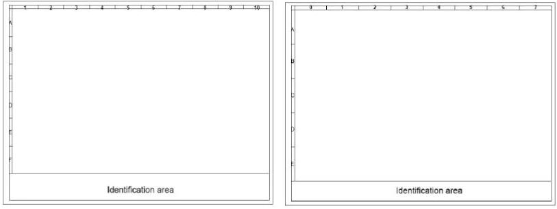


#### 2.1.2.- Gruixos de línia

Els gruixos de línia a utilitzar estaran d'acord amb la següent expressió:

> 
> 
> A on:
> - n = 0,1,2,3, ... 

Aplicant l'expressió a un mòdul de 2,5 mm obtenim la següent sèrie de gruixos: 0,25 mm; 0,35 mm; 0,5 mm; 0,7 mm; 1 mm 
No és recomanable utilitzar més de tres gruixos de línia diferents, i la relació de gruix entre el més fi i el més gruixut serà com a mínim de 2. Així dins dels gruixos normalitzats per a un mòdul 2,5 podríem utilitzar: (0,25 — 0,35 • 0,5), (0,25-0,35-0,7) o (0,25-0,5-0,7). Aquests són adequats tant si dibuixem en un format A4 com en un A3. 

Els formats de dibuix seran els normalitzats, respectant els marges de dibuix i retolació normalitzats. Això permetrà la reproducció dels esquemes sense pèrdua d'informació. 

Als textos dels esquemes s'emprarà un únic tipus de font, llegint-se totes les indicacions des de la part de baix o la dreta de la fulla (figura 4.2) L'altura dels textos complirà la següent relació:

> 
> 
> A on:
> - n = 0,1,2,3, ... 


#### 2.1.3.- Caixetins

Per a la confecció dels caixetins també se seguiran les normes generals de dibuix. Es tendirà a utilitzar els formats més petits, que continguin tota la informació que sigui necessària en cada cas.


#### 2.1.4.- Text

Les altures de text seran també les normalitzades. **L'altura més petita a emprar serà 2,5 mm**, utilitzant els tipus de text normalitzats. Per exemple, per a mòdul M = 2,5 mm, es podrien utilitzar mides de 2,3 mm; 3,5 mm; 5 mm...


### 2.2.- Regles d'identificació de conductors (EN 80617-1) 

Per regla general, s'evitaran els traços oblics de conductors, limitant-se a traços horitzontals i verticals. El traç oblic s'usarà en situacions en les quals sigui imprescindible per a facilitar la comprensió de l'esquema.

Existeixen dues maneres diferents i complementàries d'identificar els conductors en funció del tipus d'informació a representar.
- Identificació equipotencial de conductors. Es marquen conductor a conductor, amb la mateixa marca per a tots els conductors connectats al mateix punt equipotencial. 
- Informació addicional per a representar la naturalesa de la corrent, sistema de distribució, tensió, freqüència, nombre de conductors, secció de cada conductor o el material de construcció del conductor. 


#### 2.2.1.- Identificació equipotencial de conductor. 

És recomanable identificar tots els conductors mitjançant marques identificadores. En els circuits que degut la seva complexitat amb la finalitat de facilitar la comprensió aquest marcatge es fa obligatori. Aquestes marques hauran d'identificar tots els conductors en l'esquema amb les mateixes marques que portaran visibles físicament els conductors en els muntatges elèctrics. Cada conductor o grup de conductors connectats equipotencialment haurà de portar un número únic igual en tot el seu recorregut i diferent d'altres connexions equipotencials. Físicament, aquesta marca es posarà en lloc visible fixada al conductor i prop de tots i cadascun dels terminals o connexions.

Les marques inscrites en l'esquema han de poder-se llegir en dues orientacions separades amb un angle de 90., des de les vores inferior i dret del document. S'han de situar orientades en el mateixa sentit que el traç del conductor (per a traços verticals de conductor, les marques s'escriuran de baix a dalt en el sentit del traç per a poder llegir des de la vora dreta del document.) 

Les connexions equipotencials entre fulles diferents se senyalitzaran amb una fletxa de reexpedició o d'arribada (segons el cas) en la qual s'indicarà com a mínim el número de plànol del punt d'origen o final i a més una identificació comuna de la relació origen-destí identificada en cadascuna de les fletxes o bé un sistema de coordenades per quadriculació que ens aproximi a la zona d'origen o destinació.


Només es permet la reexpedició equipotencial entre parells origen - destino, per la qual cosa la reexpedició d'un cable des d'un solo pla cap a guals plans haurà d'expressar-se ramificant el circuit fins a aconseguir tantes reexpedicions com punts de destí. Si per condicions de presentació o d'impossibilitat no es pot complir el que s'ha dit, serà necessari especificar mitjançant aclariments textuals, tots els punts de destí de cada reenviament (multireenviament). Amb caràcter general, un reenviament és una connexió equipotencial, per la qual cosa tots els conductors associats al mateix parell origen-destino tindran la mateixa identificació per a indicar la continuïtat elèctrica. 

La identificació dels conductors es realitzarà generalment mitjançant un número, encara que si es desitja distingir entre grups de circuits (com per exemple circuits de potència i circuits de maniobra), es podran usar caràcters alfanumèrics davant del número d'identificació, seguint la següent regla: 
- L = Conductor de fase
- N = Conductor de neutre
- PE = Conductor de terra o de protecció 

Així: 
- LIO, L11, L12, etc. són conductors de fases
- N5, N6, N7, etc. són conductors de neutre
- PE1, PE2, PE3, etc. són conductors de terra
- 10, 11, 12, etc. són conductors de circuits sense especificar 


#### 2.2.2.- Informació addicional de conductors 

És habitual, sobretot en conductors de potència, la necessitat d'identificar en els esquemes les característiques físiques dels conductors i el número d'aquests. Per a això se segueixen les següents regles:
- Al = Conductors d'alumini
- Cu = Conductors de coure
- N = Conductors connectats a un punt neutre
- PE = conductors connectats a terra. 


#### 2.2.3.- Identificació del nombre de conductors i les seves seccions

El nombre de conductors de fase s'identifica mitjançant una xifra, seguida del símbol 'o' i a continuació la secció dels conductors. Si a més existeixen altres conductors (neutre o de terra) s'afegiran a la dreta intercalant el signe en cada conductor. 


```
┏━━━━━━━━━━━━━━━━━━━━━━━━━━━━━━━━━━━┳━━━━━━━━━━━━━━━━━━━━━━━━━━━━━━━━━━━┓
┃3x120mm²+1x150mm²                  ┃Tres conductors de fase de 120mm²  ┃
┃                                   ┃cada un y un conductor neutre de   ┃
┃3x120mm²+1x150mm² (forma resumida) ┃50mm² de secció                    ┃
┣━━━━━━━━━━━━━━━━━━━━━━━━━━━━━━━━━━━╋━━━━━━━━━━━━━━━━━━━━━━━━━━━━━━━━━━━┫
┃2x120mm² Al                        ┃Dos conductors d'alumini de 120mm² ┃
┃                                   ┃de secció                          ┃
┣━━━━━━━━━━━━━━━━━━━━━━━━━━━━━━━━━━━╋━━━━━━━━━━━━━━━━━━━━━━━━━━━━━━━━━━━┫
┃3x(2x240mm²)+1x240mm²              ┃Dos conductors en paral·lel per    ┃
┃                                   ┃cada fase de 240mm² cada un i un   ┃
┃3x(2x240mm²)+240mm² (forma abrev.) ┃conductor neutre de 240mm² de      ┃
┃                                   ┃secció.                            ┃
┗━━━━━━━━━━━━━━━━━━━━━━━━━━━━━━━━━━━┻━━━━━━━━━━━━━━━━━━━━━━━━━━━━━━━━━━━┛
```


#### 2.2.4.- Identificació de les característiques de la xarxa

```
┏━━━━━━━━━━━━━━━━━━━━━━━━━━━━━━━━━━━┳━━━━━━━━━━━━━━━━━━━━━━━━━━━━━━━━━━━┓
┃3+N ∿ 400/230V 50Hz                ┃Conjunt de conductors de 3 fases i ┃
┃3N ∿ 400/230V 50Hz                 ┃neutre amb tensió composta de 400V ┃
┃3/N ∿ 400/230V 50Hz                ┃i tensió simple de 230V, corrent   ┃
┃                                   ┃alterna a 50Hz.                    ┃
┣━━━━━━━━━━━━━━━━━━━━━━━━━━━━━━━━━━━╋━━━━━━━━━━━━━━━━━━━━━━━━━━━━━━━━━━━┫
┃                                   ┃Corrent alterna trifasica amb      ┃
┃3/N ∿ 50Hz / TN-S                  ┃neutre, 50Hz; amb esquema tipus    ┃
┃                                   ┃TN-S                               ┃
┣━━━━━━━━━━━━━━━━━━━━━━━━━━━━━━━━━━━╋━━━━━━━━━━━━━━━━━━━━━━━━━━━━━━━━━━━┫
┃                                   ┃Sistema trifàsic de corrent        ┃
┃3/N ∿ 400                          ┃alterna a 50Hz i 400V de tensió    ┃
┃                                   ┃entre fases.                       ┃
┃                                   ┃                                   ┃
┗━━━━━━━━━━━━━━━━━━━━━━━━━━━━━━━━━━━┻━━━━━━━━━━━━━━━━━━━━━━━━━━━━━━━━━━━┛
```


### 2.3.- Resum de la simbologia (EN 60617)

La norma ens ofereix una serie de símbols que, combinats, serveixen per a formar els esquemes elèctrics. Els distints components que formen part d'una instal·lació es van representant per la unió de símbols més simples. La grandària, al igual de com es dibuixen els símbols està també normalitzada. Els símbols apareixen dibuixats sobre una trama de M=2,5 mm , similar a les utilitzades en els mitjans informàtics per al dibuix d'esquemes. Per claredat, alguns símbols se'ls dibuixa al 200%, i altres al 50%, indicant-ho en cadascun. La separació entre terminals es recomana que sigui 2M. La norma permet ampliar la grandària dels símbols per a separar les connexions i facilitar la retolació, però sense escalar el gruix de la línia.

En els esquemes la simbologia de cada element que formen els circuits es representarà per un d'aquests o per combinació de diversos d'ells.


3.- Extracte de la simbologia de la EN 60617
--------------------------------------------

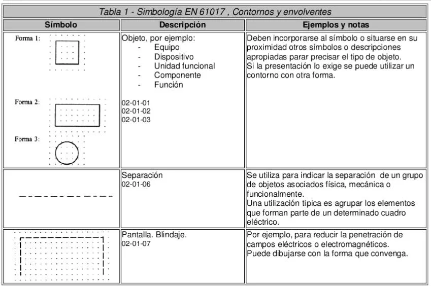

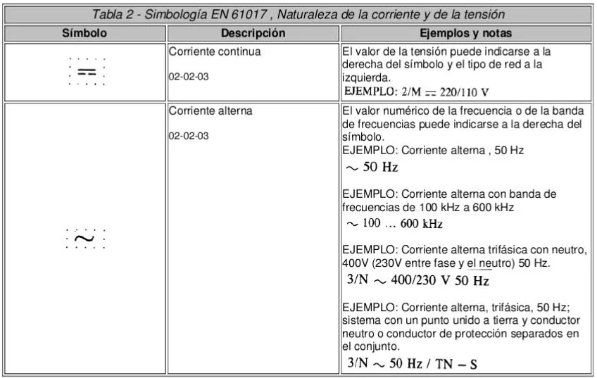


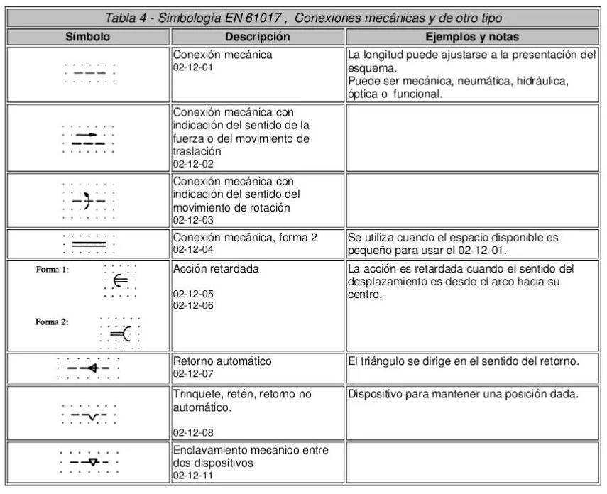

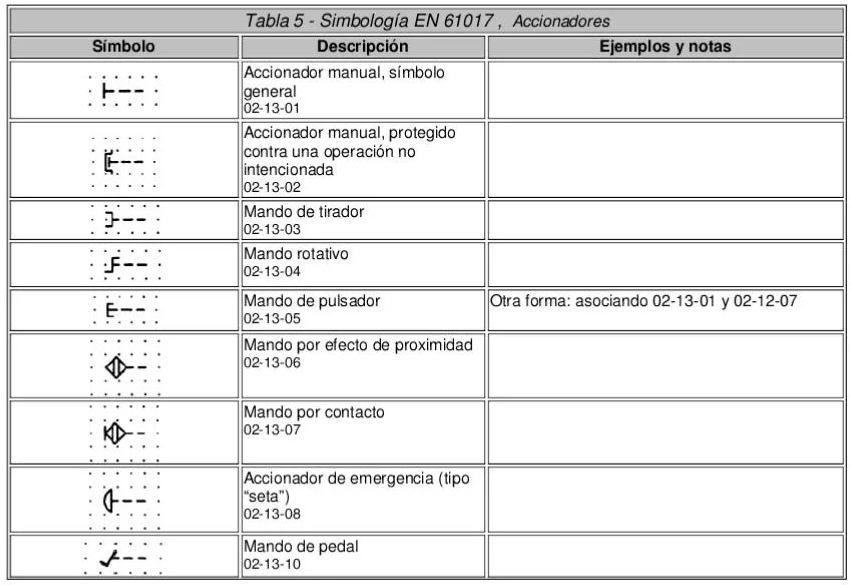

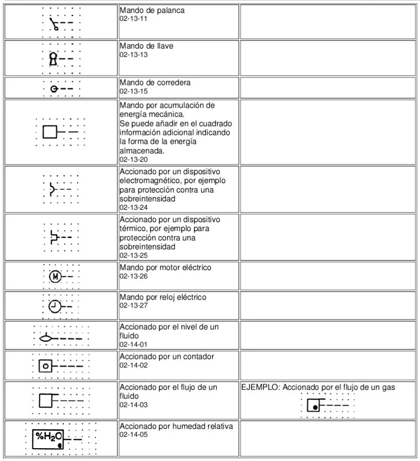

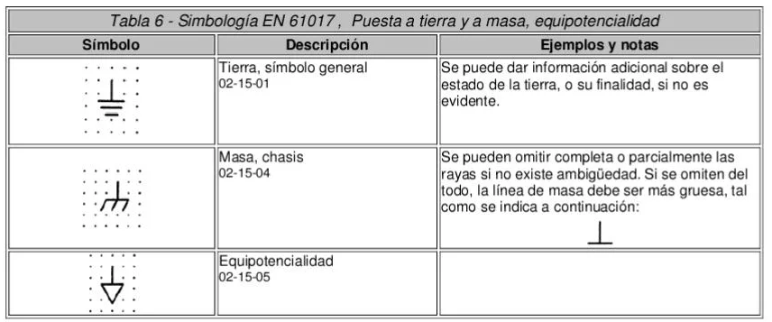

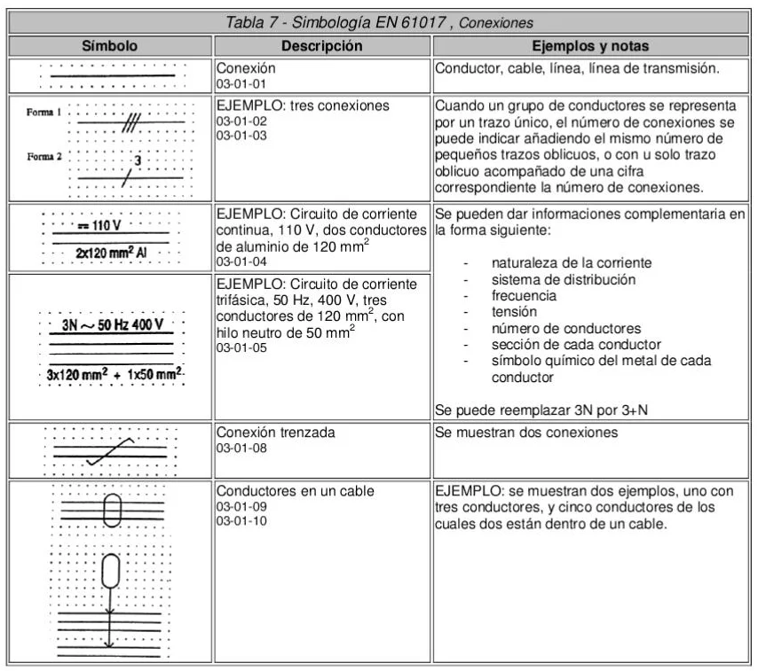

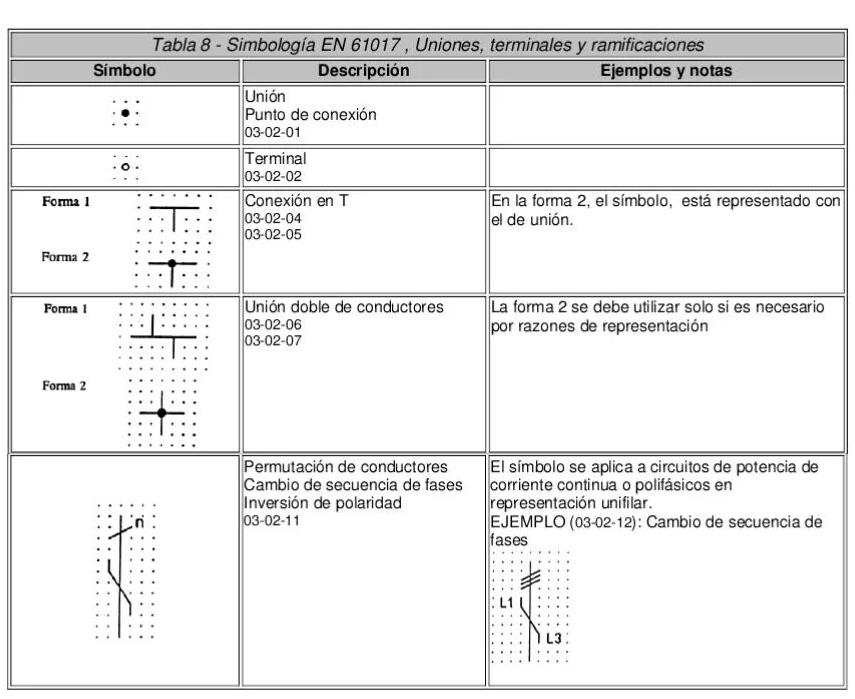


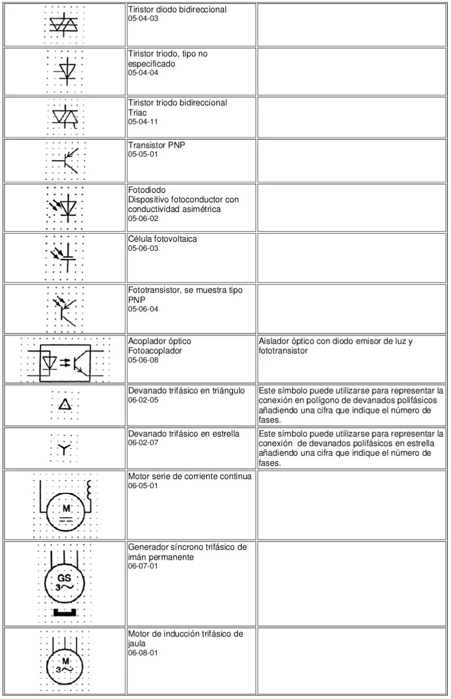

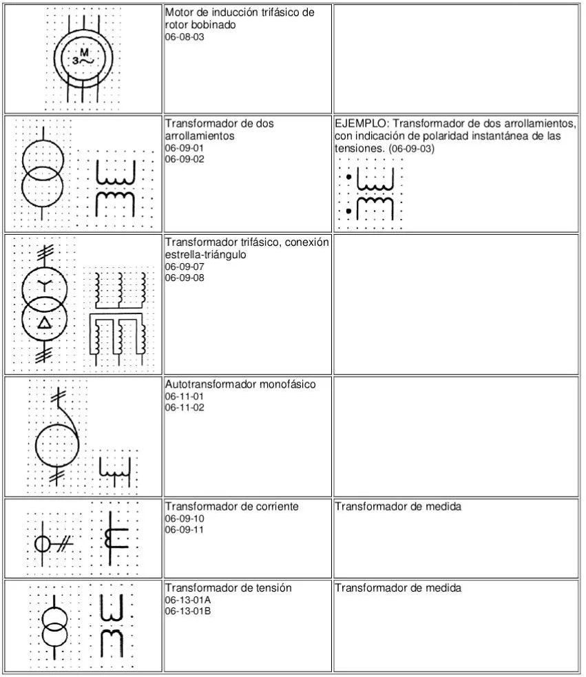


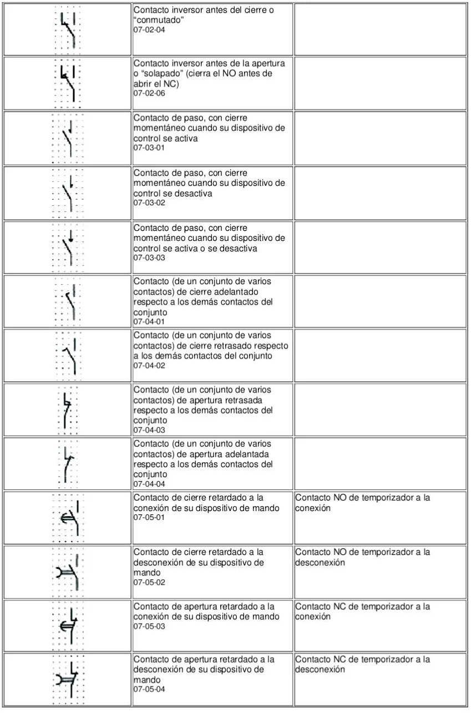

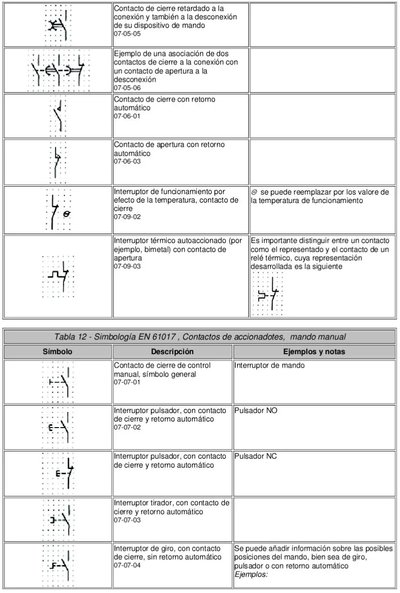


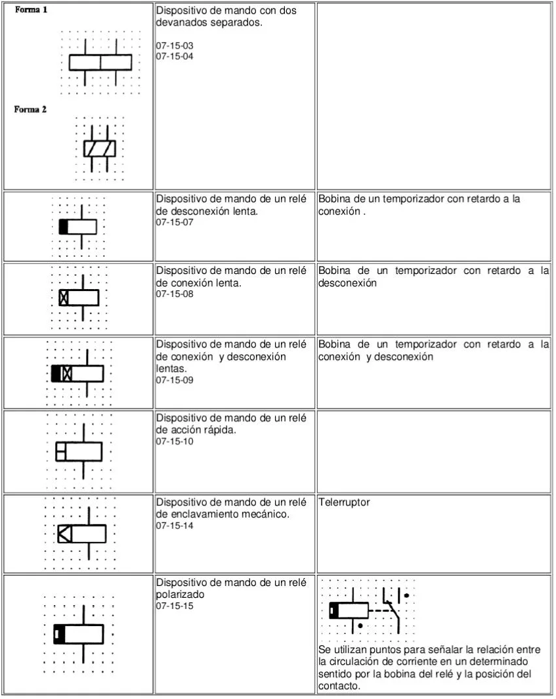

